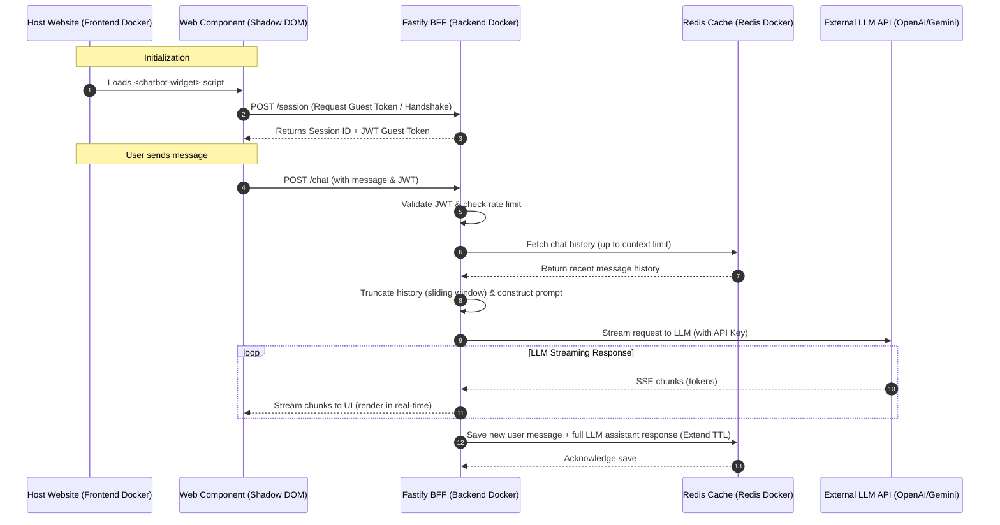

# Architectural Assessment & Implementation Blueprint: Enterprise Chatbot Widget

This document provides a production-grade, end-to-end architectural assessment and implementation blueprint for delivering a portable, highly scalable, and secure chatbot integration. 

Based on the initial alignment, the architecture is tailored to the following specifications:
*   **Frontend Widget**: Web Components (Shadow DOM) compiled using Vanilla TypeScript and Vite/esbuild.
*   **Backend Orchestration (BFF)**: Node.js (TypeScript) + Fastify.
*   **Streaming Protocol**: Server-Sent Events (SSE).
*   **State Management**: Ephemeral storage using Redis (24-hour TTL caching).
*   **Authentication**: Hybrid Auth (Anonymous guest tokens + optional host-verified JWTs).
*   **Infrastructure**: Fully Containerized Virtual Machine deployment via Docker Compose (both Frontend and Backend).
*   **Data Compliance**: No gateway masking; relying on direct Data Processing Agreements (DPAs) with LLM vendors.

---

## 1. System Architecture & Tech Stack (Mockup vs. Production)

To enable rapid prototyping of the mockup while preserving a clear path to high-scale production, the system structure is defined in two stages:

### 1.1 Local Mockup & Development Architecture
Both the Fastify BFF, the Redis cache, and the Vite frontend dev server run in Docker containers under a unified Docker network. The frontend widget communicates with the Fastify BFF over HTTP.



### 1.2 Production Extension Path (with API Gateway)
When moving to production, the Frontend Docker container is typically removed from the VM, and the built static frontend asset (`chatbot.js`) is uploaded to a global CDN (e.g. Cloudflare / AWS CloudFront) or served directly via an **Nginx Reverse Proxy**. The Nginx proxy handles SSL termination, manages rate limits, and serves the static files while forwarding API traffic to the Fastify BFF.

---

## 2. Technology Stack Rationale

| Layer | Recommended Technology | Technical Rationale |
| :--- | :--- | :--- |
| **Frontend Widget** | Vanilla TypeScript + Vite / esbuild | Zero runtime framework dependencies minimizes bundle size (~15KB gzipped), ensuring fast page loads and zero style or namespace pollution on the host website. |
| **Backend BFF** | Node.js + Fastify (TypeScript) | Fastify has a lower overhead than Express, built-in schema validation via Ajv, and native support for asynchronous streams, making it ideal for Server-Sent Events (SSE). |
| **State Store** | Redis | In-memory key-value store optimized for low-latency operations. Using Redis with a 24-hour TTL eliminates database complexity while keeping chat sessions responsive. |
| **Containerization** | Docker & Docker Compose | Provides a portable, predictable environment that can run on any VM (AWS EC2, GCP VM, DigitalOcean Droplet) without configuration drift. |

### 2.1 State Management & Context Window Optimization
Because we are utilizing **Redis Only (Ephemeral State)**, the state strategy focuses on maximizing cache performance while keeping token consumption within the LLM's limits.

1.  **Session Schema in Redis**:
    *   **Key**: `session:${sessionId}`
    *   **Value**: JSON array of messages: `[{ role: "user" | "assistant", content: "...", timestamp: 1680000000 }]`
    *   **TTL**: Set to 86400 seconds (24 hours). The TTL is reset on every new message (sliding expiration).
2.  **Context Window & Sliding Window Optimization**:
    *   LLM API costs and latency scale with prompt size. The BFF enforces a maximum token limit (e.g., 4,000 tokens for context history).
    *   Before sending the payload to the LLM, the BFF retrieves the history from Redis, calculates token counts using a lightweight library like `gpt-3-encoder` or `tiktoken`, and drops the oldest messages (excluding the system prompt) until the history fits within the target context budget.
    *   This ensures the application never crashes due to context limit violations.

### 2.2 Streaming Protocol: Server-Sent Events (SSE)
Unlike WebSockets, which require a full duplex connection and custom messaging protocols, SSE operates over standard HTTP:
*   **Fastify Implementation**: Uses `res.raw.writeHead(200, ...)` with headers:
    ```http
    Content-Type: text/event-stream
    Cache-Control: no-cache
    Connection: keep-alive
    ```
*   **Client Consumption**: The widget utilizes the standard `fetch` API and reads the response body via a `ReadableStreamDefaultReader` rather than the `EventSource` interface. This allows sending `POST` requests containing custom authorization headers and payload body configurations.

---

## 3. Portability & Plugin Feature Architecture

### 3.1 Comparative Analysis of Plugin Integration Methods

| Metric | Web Components (Shadow DOM) | iFrame Sandbox | Vanilla JS Injection |
| :--- | :--- | :--- | :--- |
| **Style Encapsulation** | **Excellent**. CSS rules cannot leak out, and host CSS cannot leak in (except CSS variables). | **Absolute**. Completely isolated browsing context. | **Poor**. Host CSS can easily override widget styling unless strict CSS reset/scoping is used. |
| **Bundle Size** | **Small** (~10–20KB). | **Medium** (requires full HTML document structure + JS bundle). | **Small** (~10–20KB). |
| **Host Communication** | **Native**. Uses DOM events, properties, and attributes. | **Complex**. Requires `window.postMessage` serialization. | **Native**. Direct DOM access. |
| **Host DOM Impact** | **None**. Runs inside Shadow Root. | **None**. Runs inside separate document. | **High**. Can pollute global namespace and collide with existing DOM elements. |
| **Responsiveness** | **Fluid**. Integrates naturally with host layout, can overlay overlays. | **Difficult**. Requires dynamic resizing scripts to prevent viewport clipping. | **Fluid**. Integrates naturally. |
| **Recommendation** | **Highly Recommended** | Recommended only if absolute JS security isolation is required. | Not recommended for modern enterprise widgets. |

### 3.2 Implementing the Shadow DOM Web Component
To instantiate the widget, the client places a single `<script>` tag and the custom HTML tag:

```html
<!-- Client Page -->
<script src="http://localhost:5173/src/widget.ts" type="module"></script>
<chatbot-widget 
  api-url="http://localhost:3000" 
  theme="dark" 
  client-jwt="optional-host-signed-jwt">
</chatbot-widget>
```

---

## 4. Security & Compliance

### 4.1 LLM API Key Safeguarding
*   **Zero Exposure to Client**: The LLM API keys are loaded solely as environment variables in the backend Node.js container. The client never communicates directly with the LLM.

### 4.2 Hybrid Authentication & Token Management
To prevent unauthorized API proxy abuse, implement a multi-stage authentication system:

1.  **Anonymous Guest Tokens**:
    *   On load, the widget requests a handshake token from `/session`.
    *   The BFF issues a short-lived JSON Web Token (JWT) signed with a backend-only secret. The JWT payload contains the `sessionId` and a guest status.
    *   Subsequent requests to `/chat` must include this JWT in the `Authorization: Bearer <token>` header.
2.  **Host-Verified JWTs (Authenticated Users)**:
    *   If a client site has logged-in users, the client backend generates a JWT signed with a shared secret or verified via a public keyset (JWKS).
    *   The host passes this JWT to the widget, which forwards it to the BFF.
    *   The BFF validates the JWT and can customize the chat session context (e.g., retrieving the user's name, email, or order history).

### 4.3 Rate Limiting & Anti-Abuse
Apply rate limiting at the Fastify layer:
*   Handshake Route (`/session`): Limit to **5 requests per minute** per IP.
*   Stream Route (`/chat`): Limit to **20 requests per minute** per Session ID.
*   **Max Token Length Check**: Reject inputs exceeding 1000 characters to prevent prompt injection or Denial-of-Service.

---

## 5. Infrastructure & Scalability

### 5.1 Unified Docker Compose Architecture (Local Development)
This configuration spins up the Node.js Fastify BFF app, the Vite frontend app, and the Redis instance in a shared bridge network.

```yaml
version: '3.8'

services:
  bff:
    image: chatbot-bff:latest
    container_name: chatbot_bff
    build:
      context: ./backend
      dockerfile: Dockerfile
    ports:
      - "3000:3000"
    environment:
      - PORT=3000
      - REDIS_URL=redis://redis_cache:6379
      - JWT_SECRET=${JWT_SECRET}
      - LLM_PROVIDER=${LLM_PROVIDER:-openai}
      - LLM_MODEL=${LLM_MODEL:-}
      - OPENAI_API_KEY=${OPENAI_API_KEY:-}
      - GEMINI_API_KEY=${GEMINI_API_KEY:-}
      - ALLOWED_ORIGINS=http://localhost:5173
    depends_on:
      - redis_cache
    networks:
      - chatbot_net
    restart: always

  redis_cache:
    image: redis:7-alpine
    container_name: chatbot_redis
    command: redis-server --maxmemory 256mb --maxmemory-policy allkeys-lru --save ""
    ports:
      - "127.0.0.1:6379:6379"
    networks:
      - chatbot_net
    restart: always

  frontend:
    image: chatbot-frontend:latest
    container_name: chatbot_frontend
    build:
      context: ./frontend
      dockerfile: Dockerfile
    ports:
      - "5173:5173"
    environment:
      - VITE_API_URL=http://localhost:3000
    depends_on:
      - bff
    networks:
      - chatbot_net
    restart: always

networks:
  chatbot_net:
    driver: bridge
```
